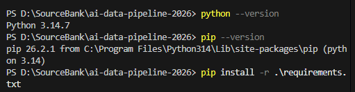

# AI Agentic Data Pipeline 2026

### download to computer:

Git
pipeline: 

## Data pipeline:

collect data need for domain and delivery system of refine/transform, save/analysis system.

Libraries:

1. NumPy - array
2. Pandas - table format
3. Matplotlib - chart visualization
4. Seaborn - design Matplotlib
5. Selenium - automatic data collection
6. Folium - map visualization
7. BeautifulSoup - static data collection
8. NumPy

- NumPy is faster than python List
- vectorized operation

  | phase       | meaning                                | example                             |
  | :---------- | -------------------------------------- | ----------------------------------- |
  | collect     | retrieve data (web scrapping)          | read CSV/excel, DB select, API      |
  | refine      | modify wrong data                      | remove missing and replicates       |
  | transform   | preprocessing for analysis             | add calculation column, change date |
  | save        | saving the result                      | CSV, Excel, DB save                 |
  | utilization | ready for data analysis, start service | EDA, Dashboard, report              |

  - `ndim`: dimension of array
  - `shape`: structure of array rows and column
  - `size`: numbers of data
  - `dtype`: data type of array

2. Pandas

- there are similar statistic functions in Pandas
  --> Pandas has more usability
- Data structure
  a. Series (one column), (multiple series = dataframe)
  b. DataFrame (variable name= df): Pandas's basic data structure (2-dimension table), Similar structure as Excel, CSV, DB table
  [See](./chapter01/Pandas.ipynb)  *ipynb is JSON file
- Pandas 속성 & functions

  1. df = pd.DataFrame('file name')
  2. df.head() & df.tail()
  3. df.shape()
  4. df.column()
  5. df.info()
  6. df.describe()
  7. df.loc['number or string'] vs. df.iloc['number or string']
     => loc considers the number as label, and iloc considers the number index!
     [see](/chapter02.ipynb)
  8. 
  9. df[' '].unique()
- Handling Missing Data

  1. Delete every rows with Null value:
  2. Delete rows by filtering: df_dropna(subset)
  3. Replace with Average: filter with condition first then fill in

3. Visualization - Matplotlib, Seaborn
   [see](/chapter03/visualization.ipynb)

- EDA (exploratory data analysis): 탐색적 데이터 분석 시 사용

4. Selenium
- scrapping, openAPI
- `HTML` `CSS` `JS`... required
  - In CSS, 속성명에만 신경쓰면됨. class="class_name" 등
  - js 사용하면 동적 구현 (html보다)
  - 

TIPS:

<Pandas tips>
  - empty string vs. null/Nan => consider as different values, so change the empty string to Null or Nan value

- Email pattern(format Type) = r"^[\w\.-]+@[\w\.-]+\.\w+$"
